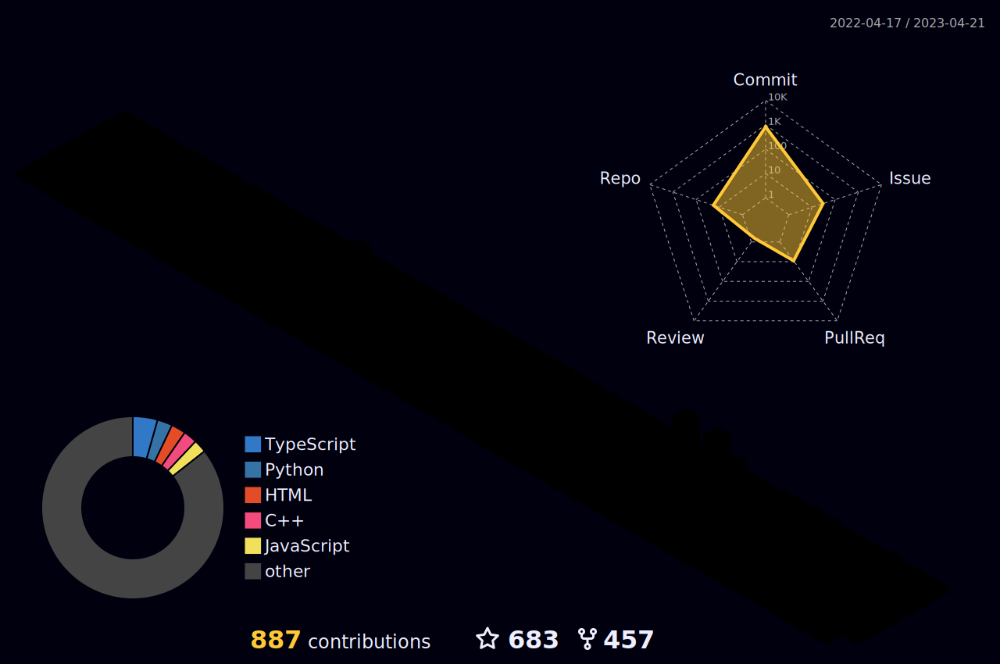
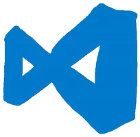

<!--
 * @Editor: Microsoft VS Code
 * @Author: HuangRongQuan
 * @version:
 * @Date: 2023-04-14 10:38:23
 * @LastEditors: Please set LastEditor
 * @LastEditTime: 2023-04-21 14:25:08
 * @FilePath: \Aloof\README.md
 * @Descripttion:
 * reference article: GitHub 配置文件自述文件
 * https://dev.to/charalambosioannou/create-a-dynamic-github-profile-readme-il5
-->

  

  <!-- dynamic typing effect 动态打字效果 -->
  

      
  

  <!-- knock code pictures 敲代码的动图 -->
  

   
  

  <!-- Snake Code Contribution Map 贪吃蛇代码贡献图 -->
  

  
  

<table>
<tr><td>

# 🤺 About Me <!--关于我-->

&emsp;&emsp;Hi everyone, I'm Aloof.

&emsp;&emsp;Currently studying at Shenzhen University of Technology, majoring in computer science and technology.

&emsp;&emsp;Now that I have chosen this major, I am motivated to become a senior engineer!

&emsp;&emsp;After trying many directions, I currently want to be a Java and Go language developer.

&emsp;&emsp;My motto is to follow the trend and avoid disadvantages.

</td></tr>

<tr><td>

# 🏢 Study & Work Experience

- [Shenzhen University of Technology](https://www.sztu.edu.cn/) &emsp; 📌 2020-09-17 —— now

  - College: [School of Big Data and Internet](https://bdi.sztu.edu.cn/)
  - Major: Computer Science and Technology

 

- [Shenzhen Urban Public Safety Technology Research Institute](https://www.szsti.org/#/) &emsp; 📌 in progress

  - Job: Intern at R&D Center (Academician Office)
  - work content: Participated in the project of "UAV Close-range Photogrammetry Monitoring Landslide Deformation"

 

</td></tr>

<!-- just img 图片 -->

<!-- profile-3d-contrib 3D贡献图-->

<!--  skill badge 技能徽章 -->

💪 Currently learning

🧠 Plan deep learning

🧰 Commonly used tools

<!-- programming tool icon 编程工具图标 -->

 

<!-- svg -->

 

 

<!-- gif -->

 

<!-- GitHub Activity Graph GitHub 活动图 -->

<!-- GitHub 奖杯🏆 -->

<!-- Wakatime Graph-->

<table>
  
</table>
<table>
  The following is my Coding Activity being counted by WakaTime.
</table>
<table>
  <tr>
     &nbsp;
     
  </tr> 
   
  <tr>
     &nbsp;
    
  </tr>
</table>

<!-- run 图片 -->

<!-- github-readme-streak-stats 连续提交代码天数记录 -->

&emsp;
&emsp;

<!-- just img 图片 -->

<!-- just img 图片 -->

<!--
## About me

&emsp; 🙋 Hi everyone, I'm aloof, currently working on becoming a Java and Go developer.

Aloof's github visitor counts 

