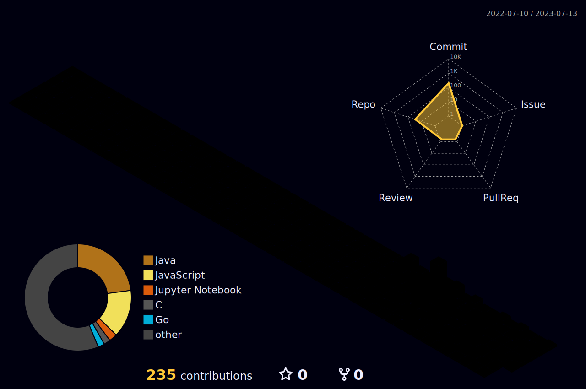

<!--
 * @Editor: Microsoft VS Code
 * @Author: HuangRongQuan
 * @version:
 * @Date: 2023-04-14 10:38:23
 * @LastEditors: Please set LastEditor
 * @LastEditTime: 2023-04-21 14:25:08
 * @FilePath: \Aloof\README.md
 * @Descripttion: GitHub 配置文件自述文件
-->

  

      
  

  

   
  

  

    <picture>
    <source media="(prefers-color-scheme: dark)" srcset="https://raw.githubusercontent.com/hhrwvyy5654v/hhrwvyy5654v/output/github-contribution-grid-snake-dark.svg">
    <source media="(prefers-color-scheme: light)" srcset="https://raw.githubusercontent.com/hhrwvyy5654v/hhrwvyy5654v/output/github-contribution-grid-snake.svg">
    
    </picture>
  

# 🙋 Hello

<table>
<tr><td>

## 🤺 About Me

&emsp;&emsp;Hi everyone, I'm Aloof.

&emsp;&emsp;Currently studying at Shenzhen University of Technology, majoring in computer science and technology.

&emsp;&emsp;Now that I have chosen this major, I am motivated to become a senior engineer!

&emsp;&emsp;After trying many directions, I currently want to be a full stack developer.

&emsp;&emsp;My motto is to follow the trend and avoid disadvantages.

</td></tr>

<tr>
<td>

## 🏢 Study & Work Experience

- [Shenzhen University of Technology](https://www.sztu.edu.cn/)  
  📌 Enrolled from September 17, 2020 to present

  - College: [Big Data and Internet](https://bdi.sztu.edu.cn/)
  - Major: Computer Science and Technology 
   
- [Shenzhen Urban Public Safety Technology Research Institute](https://www.szsti.org/#/) 
  📌 2023/02/01 ~ 2023/06/16

  - Job: Intern at R&D Center (Academician Office)
  - work content: Participated in the project of [UAV Close-range Photogrammetry Monitoring Landslide Deformation](https://github.com/hhrwvyy5654v/UAV-Close-Range-Photogrammetry-To-Monitor-Landslide-Deformation)

</td>
</tr>

<table>

  

💪 Currently learning

 

🧠 Plan deep learning

 

🧰 Commonly used tools

 

  

  

  

## 👏 My Skills Chart

</img>

   

  <!-- gif -->
  
  
  
  
  
  
   

  <!-- svg -->
  
  
  
  
   
  
  
  
  
  
  

  

<!-- <table>
  <tr>
    

       &ensp;
      
    

  </tr>
   
  <tr>
    

       &ensp;
      
    

  </tr>
</table> -->

<!-- <tr><td>

## 🤾‍♂️ Recent life

</td></tr> -->